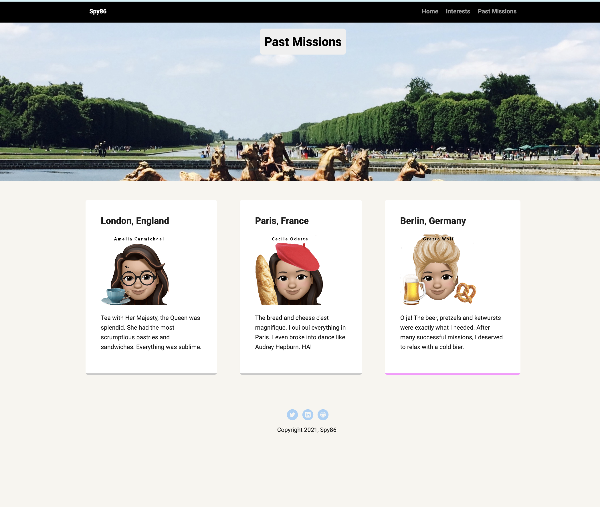

# Mock Portfolio Project - Spy86 Profile Website

My first project with HTML and CSS was to make a mock portfolio website.

With a template provided, I customized this website to include images, content, navigation, and additional pages.

